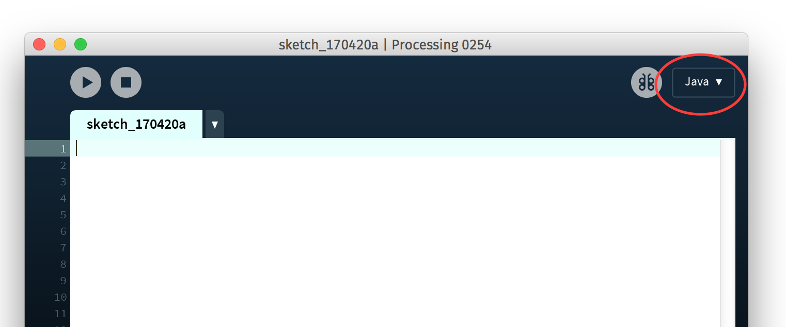
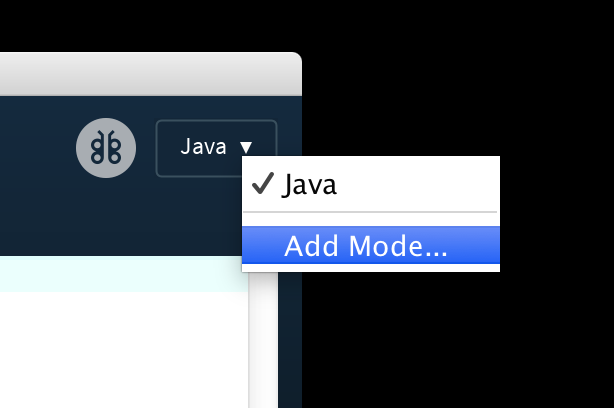
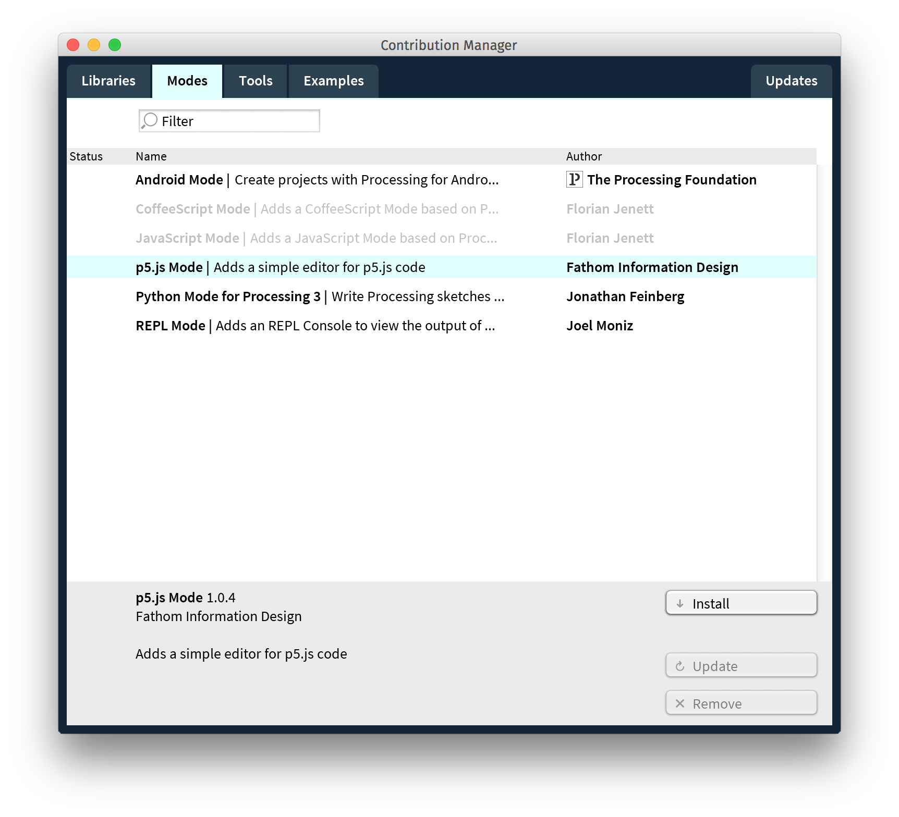
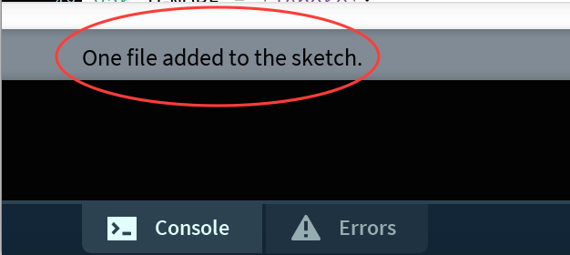
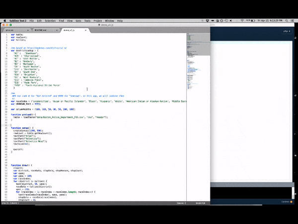
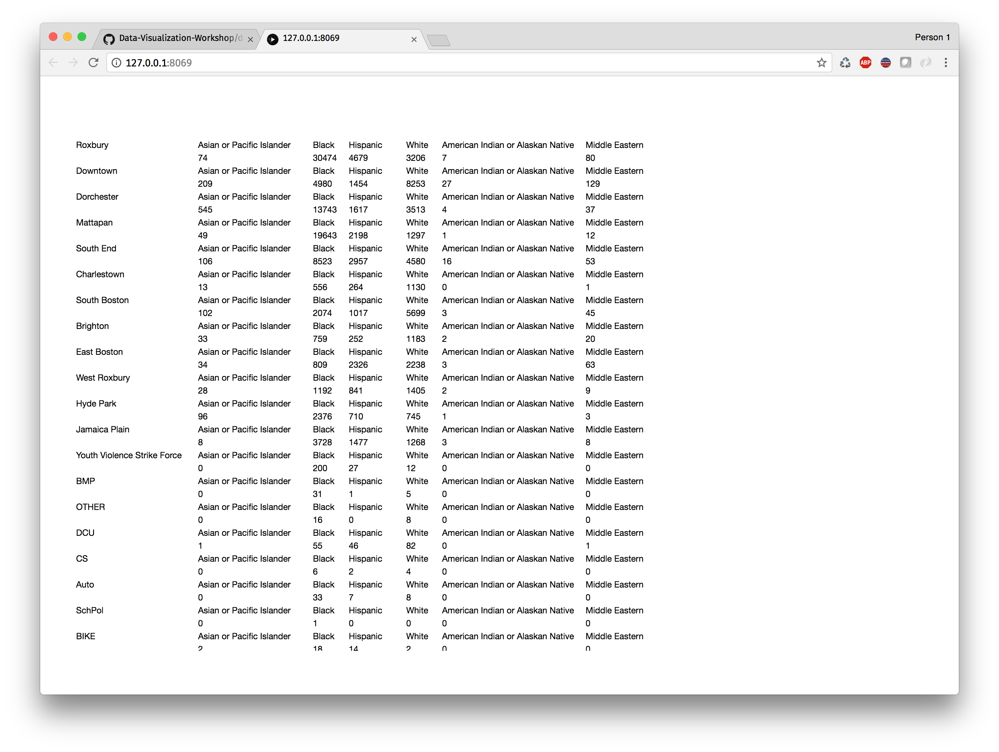

# Data Visualization Workshop

This is the repository for the Data Visualization workshop at Hack for Democracy.

## Setup Instructions

Our demo will be using Processing, a flexible coding environment with an emphasis on coding for visual displays. Processing has different modes target ing desktop, print, and the web. By default, the web version is not enabled, so here are instructions for downloading processing and installing the web mode, which based on p5.js.

Download processing from https://processing.org/download/

Run it once you have it installed. In the upper right, you will see a button that says “Java”. Click it:

You will see an option to “Add Mode”, select that

From the window that opens up, select p5.js Mode, and press the install button.

When that is done, go back to the “Java” button in the upper right, and select the brand new “p5.js” mode.

## Running the demo code

We are using the Boston Police Department FIO data for this example. Go to https://data.cityofboston.gov/Public-Safety/Boston-Police-Department-FIO/xmmk-i78r, click the "Download" button, and choose the "CSV" option (but not the "CSV for Excel" option). 

If you want to explore the data, we recommend using LibreOffice, downloadable from https://www.libreoffice.org/. The BPD FIO csv file is 62 Mb, and Excel often chokes on files that large. You will encounter some slowness with LibreOffice as well, but we have found it to be more reliable than excel. Once you have the file open, you might also try copying a sample, say 1,000 records, to a separate file. Using the small file allows you to quickly check whether your code is behaving. Once it is behaving OK, try it against the full dataset. 

Once the file is downloaded, you can drag it into your processing sketch. You should see feedback at the bottom saying "One file added to the sketch".

Then, grab the file demo_v1.js from this repository. Open it in a text editor, like Notepad or textEdit, and copy the full contents of the file. Paste the text into the processing editor, then hit the play button at the top. It will open a tab in your browser, and the page will have the text "Loading...". This will take a while, as the code is loading the entire 62 Mb file, and then tallying various columns across all 150k rows. 

Once it is done loading, you should see something like this:

Voila!
